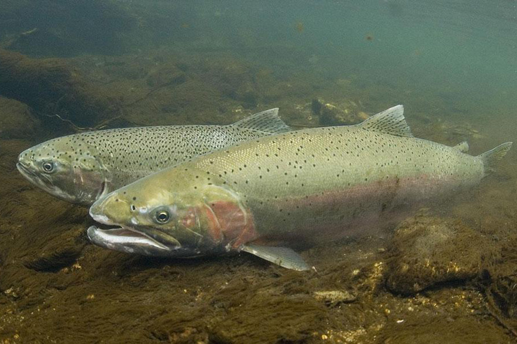

```{r setup, include = FALSE}
knitr::opts_chunk$set(echo = TRUE,
                      message = FALSE,
                      warning = FALSE)
```

<br>

Bonneville Lock and Dam's first powerhouse was completed in 1938 on the Columbia River in Oregon to provide hydropower to the Pacific Northwest (U.S. Army Corps of Engineers, n.d.). This project visualizes changes in steelhead salmon passage counts across Bonneville Dam from 1940 - 2019. It first looks at changes in daily counts, then changes in monthly and yearly counts over the same time period. 

<center>

{width=550px}

</center>


<style>
p.caption {
  font-size: 0.9em;
  font-style: italic;
  color: grey;
  margin-right: 10%;
  margin-left: 15%;  
  text-align: left;
}
</style>


```{r, packages}

# Load packages

# General
library(tidyverse)
library(janitor)
library(lubridate)
library(here)
library(paletteer)

# Time Series 
library(tsibble)
library(fable)
library(fabletools)
library(feasts)
library(forecast)

```


```{r}

# Read in data

salmon <- read_csv("cbr_fish_passage_bonneville_allyrs_steelhead.csv") %>% 
  clean_names()

```

```{r}

# Wrangle data for daily counts

salmon_day <- salmon %>%
  unite(year, mm_dd, col = "date", sep = "-") %>% # unite year and mmdd column and selarate the values with "-"
  mutate(yr_mo_day = lubridate::parse_date_time(date, "ydm")) %>% # formate date
  drop_na(yr_mo_day, value) # drop NAs from value column

```

```{r, fig.align = 'center', fig.cap = "**Figure 1. Daily Steelhead Salmon Passage at Bonneville Dam (1940 - 2019).** Time-seris plot showing daily changes in steelhead salmon counts at Bonneville Dam. Data accessed at: http://www.cbr.washington.edu/dart/query/adult_graph_text"}

# Create graph of daily counts

salmon_day_gg <- ggplot(data = salmon_day, aes(x = yr_mo_day, y = value)) +
  geom_line(color = "forestgreen") +
  labs (x = "Year", y = "Count") +
  scale_y_continuous() +
  theme_minimal()

salmon_day_gg

```

```{r}

# Wrangle data for monthly counts

salmon_parse <- salmon_day %>% 
  mutate(month = month(yr_mo_day, label = TRUE)) %>% # oull month from yr_mo_day, label = true gives months 3 letter label
  mutate(year = year(yr_mo_day))

salmon_monthly <- salmon_parse %>% 
  group_by(year, month) %>%
  summarize(total = sum(value))

```

```{r, fig.align = 'center', fig.cap = "**Figure 2. Monthly Steelhead Salmon Passage at Bonneville Dam (1940 - 2019).** Time-seris plot showing monthly changes in steelhead salmon counts at Bonneville Dam. Counts were totaled by month for each year. Data accessed at: http://www.cbr.washington.edu/dart/query/adult_graph_text"}

# Graph data for monthly counts

salmon_month_gg <- ggplot(salmon_monthly, aes(x = month, y = total, group = year)) + # separate by year
  geom_line(aes(color = year)) + # color by year
  labs (x = "Month", y = "Count") +
  scale_color_paletteer_c("ggthemes::Blue-Teal") + # change color palette
  scale_y_continuous() +
  theme_minimal()

salmon_month_gg

```

```{r}

# Wrangle data for yearly counts

salmon_yearly <- salmon_parse %>% 
  group_by(year) %>% 
  summarize(total = sum(value))

```

```{r, fig.align = 'center', fig.cap = "**Figure 3. Annual Steelhead Salmon Passage at Bonneville Dam (1940 - 2019).** Time-seris plot showing daily changes in steelhead salmon counts at Bonneville Dam. Counts were totaled by year. Data accessed at: http://www.cbr.washington.edu/dart/query/adult_graph_text"}

# Graph data for yearly counts

salmon_year_gg <- ggplot(salmon_yearly, aes(x = year, y = total)) +
  geom_line(color = "forestgreen") +
  labs (x = "Year", y = "Count") +
  scale_y_continuous() +
  theme_minimal()

salmon_year_gg


```

</br>
**Referneces**
</br>
Columbia River DART, Columbia Basin Research, University of Washington. (2019). Adult
Passage Graphics & Text. Available from http://www.cbr.washington.edu/dart/query/adult_graph_text

</br>
U.S. Army Corps of Engineers. (n.d). *Bonneville Lock & Dam*. Retrieved February 19, 2020, from https://www.nwp.usace.army.mil/bonneville/
